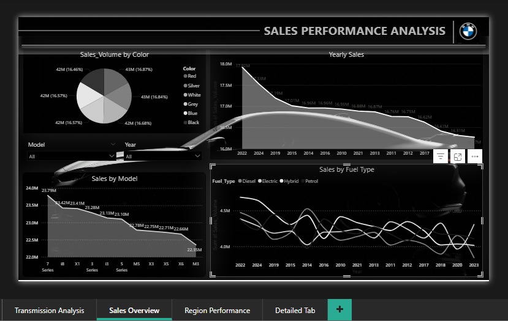
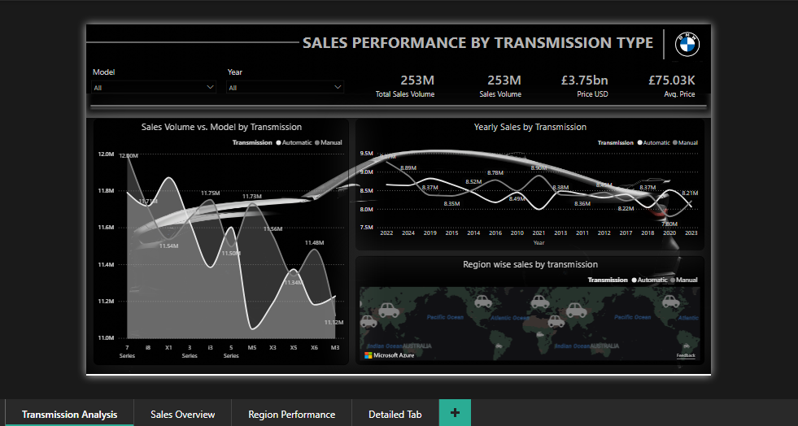
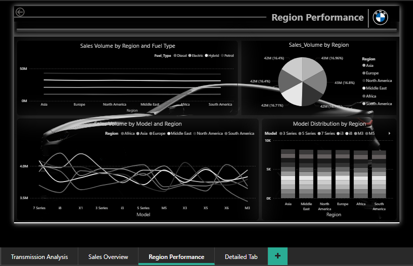

# BMW Sales Analysis Dashboard (Power BI)

## Overview
This project analyzes BMW sales data from 2010–2024 using Power BI.

The dashboard provides insights into:
- Sales by Region
- Transmission performance
- Model trends
- Fuel type analysis

---

## Dashboard Pages
1. Sales Overview
2. Transmission Analysis
3. Region Performance
4. Detailed Drill-through Report

---

## Tools Used
- Power BI
- Data Modeling
- DAX
- Data Visualization

---

## Dataset
BMW Sales Data (2010–2024)

---

## Dashboard Preview

---

## Author
Rutvi Sorathiya  
Power BI Developer  

LinkedIn: https://linkedin.com/in/rutvi-sorathiya
